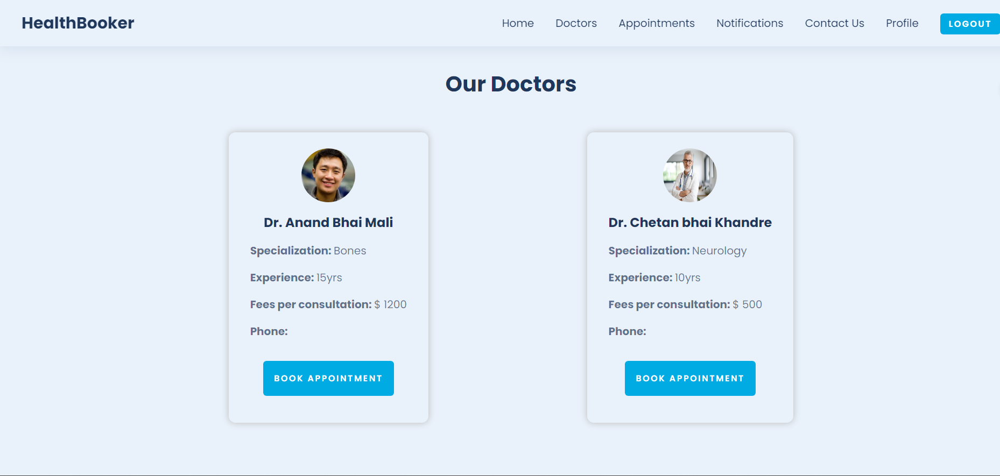

# HealthBooker🧑‍⚕️

<h3>Description :</h3> 
This is a webapp where you can book an appointment with a doctor.

 

### 📃Features :

<ul>
<li>User can register and login.</li>
<li>You can view all available doctors on the site.</li>
<li>You can also update your profile.</li>
<li>You can also send your queries to us from the contact section.</li>
<li>You can view all your notifications in the notifications tab.</li>
<li>There is also an admin managment system.</li>
<li>You can only access your notications, profile, appointments, doctor application if you're logged in</li>
<li>User can also apply for becoming a doctor on our site.</li>
<li>User can book an appointment with the doctor of their own choice.</li>
<li>Admin has the control to accept any user's request to become a doctor.</li>
<li>Admin can also remove any user or doctor from the site.</li>
<li>Doctor and Admin have the control to mark if the appointment is completed.</li>
<li>User will recieve notification if their application is accepted or rejected.</li>
<li>User and Doctor will recieve notification if their appointment is completed.</li>
<li>Doctor will recieve notification if someone booked appointment with them.</li>
<li>All the data will be stored on the database so there is no chance of losing you information.</li>
</ul>

### Home Page

### Doctors Page

### Apply for Doctors Page

### Book Appointment

### Notifications

### Profile Page

### Sign up Page

### Sign in Page

### Admin Dashboard: Users

### Admin Dashbaord: Doctors

### Admin Dashboard: Applications

